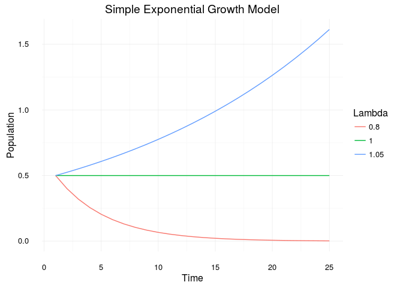
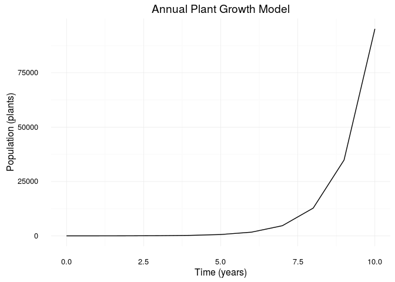

# Simple Models
Nick Gauthier  
August 29, 2016  


First load some packages to make life easier.

```r
library(ggplot2) # for plotting
library(reshape2) # to reshape simulation outputs to make plotting easier
library(magrittr) # allows for pipe commands (%>%) to enhance readability
```


## Plotting a sine function

Define a time vector $t$.

```r
t <- seq(-pi, pi, 0.01)
```

Plot it.

```r
qplot(x = t, y = sin(t), geom = 'line') +
  theme_minimal()
```

<!-- -->

## Simple population growth model
First define a function we'll use to run the model given 3 parameters.


```r
pops <- function(A, x, N){ # define a function for running the population model w/ 3 parameters
  n <- rep(NA, N) # create an empty vector of length N
  n[1] <- x # set the first entry in the vector to x
  for(i in 2:N){ # loop over the remaining indices in N
    n[i] <-  A * n[i - 1] # exponential growth model
  }
  return(n) # return the output vector n of populations
}
```

Now define some parameters for the model.

```r
nsim <- 25 # define simulation length here so easy to change
lambdas <- c(0.8, 1, 1.05) # iterate over several values of lambda
```

Run the model and preprocess the results for plotting.

```r
sim <- sapply(lambdas, pops, x = .5, N = nsim) %>% # run the pop function with each value of lambda
  set_colnames(lambdas) %>% # set the column names accordingly
  melt # use reshape to melt the datafram so ggplot can read it easier
```

Finally plot the results with ggplot.

```r
qplot(x = Var1, y = value, color = as.factor(Var2), data = sim, geom = 'line') + 
  labs(title = 'Simple Exponential Growth Model', x = 'Time', y = 'Population') +
  scale_color_discrete(name = 'Lambda') +
  theme_minimal()
```

<!-- -->

## Annual Plant Model

```r
plant.pops <- function(alpha, beta, gamma, sigma, P1, P2, N){
  # Model Parameters
  # alpha = germination rate 1-year old seeds, 0 <= alpha <= 1
  # beta = germination rate 2-year old seeds, 0 <= beta <= 1
  # gamma = number of seeds per plant, gamma > 0 (big)
  # sigma = over winter survival . . .
  A <- alpha * sigma * gamma
  B <- beta * (1 - alpha) * sigma^2 * gamma
  
  # initial conditions
  P <- rep(NA, N) # create an empty vector of length N
  P[1] <- P1 # set the first entry in the vector to x
  P[2] <- P2
  
  # here is the finite difference model ...
  for(i in 2:N){ # loop over the remaining indices in N
    P[i + 1] <-  A * P[i] + B * P[i - 1] #
  }
  return(P) # return the output vector P of populations
}
```

Run the simulation. Let's start with a parameterization of $\alpha = \beta = \sigma = 0.5$

```r
nsim <- 10
plant.sim <- plant.pops(.5, .5, 10, .5, 10, 10, nsim)
```

Plot the results

```r
qplot(x = 0:nsim, y = plant.sim, geom = 'line')  + 
  labs(title = 'Annual Plant Growth Model', x = 'Time (years)', y = 'Population (plants)') +
  theme_minimal()
```

<!-- -->

